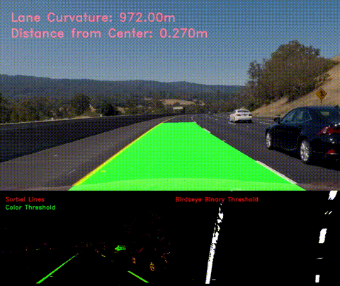

## Advanced Lane Finding
[](http://www.udacity.com/drive)



## Writeup

**Advanced Lane Finding Project**

The goals / steps of this project are the following:

* Compute the camera calibration matrix and distortion coefficients given a set of chessboard images.
* Apply a distortion correction to raw images.
* Use color transforms, gradients, etc., to create a thresholded binary image.
* Apply a perspective transform to rectify binary image ("birds-eye view").
* Detect lane pixels and fit to find the lane boundary.
* Determine the curvature of the lane and vehicle position with respect to center.
* Warp the detected lane boundaries back onto the original image.
* Output visual display of the lane boundaries and numerical estimation of lane curvature and vehicle position.

[//]: # (Image References)

[image1]: ./output_images/undistort_output.png "Undistorted"
[image2]: ./output_images/distortion_correction.png "Road Transformed"
[image3]: ./output_images/threshold.png "Binary Example"
[image4]: ./output_images/before_perspective.png "Before Perspective"
[image5]: ./output_images/after_perspective.png "After Perspective Change"
[image6]: ./output_images/lane_region.png "Lane Region"
[image7]: ./output_images/final_output.png "Output"
[video1]: ./project_video.mp4 "Video"

## [Rubric](https://review.udacity.com/#!/rubrics/571/view) Points

### Here I will consider the rubric points individually and describe how I addressed each point in my implementation.  

---

### Writeup / README

#### 1. Provide a Writeup / README that includes all the rubric points and how you addressed each one.  You can submit your writeup as markdown or pdf.  [Here](https://github.com/udacity/CarND-Advanced-Lane-Lines/blob/master/writeup_template.md) is a template writeup for this project you can use as a guide and a starting point.  

You're reading it!

### Camera Calibration

#### 1. Briefly state how you computed the camera matrix and distortion coefficients. Provide an example of a distortion corrected calibration image.

The code for this step is contained in the 'Camera Calibration' cell of the IPython notebook located in "Advanced Lane Finding.ipynb"

I start by preparing "object points", which will be the (x, y, z) coordinates of the chessboard corners in the world. Here I am assuming the chessboard is fixed on the (x, y) plane at z=0, such that the object points are the same for each calibration image.  Thus, `objp` is just a replicated array of coordinates, and `objpoints` will be appended with a copy of it every time I successfully detect all chessboard corners in a test image.  `imgpoints` will be appended with the (x, y) pixel position of each of the corners in the image plane with each successful chessboard detection.  

I then used the output `objpoints` and `imgpoints` to compute the camera calibration and distortion coefficients using the `cv2.calibrateCamera()` function.  I applied this distortion correction to the test image using the `cv2.undistort()` function and obtained this result: 

![alt text][image1]

### Pipeline (single images)

#### 1. Provide an example of a distortion-corrected image.

The image below shows the distortion correction from the camera calibration appiled to a pipeline frame. This was accomplished using the results of the camera calibration and the `cv2.undistort` method.

![alt text][image2]

#### 2. Describe how (and identify where in your code) you used color transforms, gradients or other methods to create a thresholded binary image.  Provide an example of a binary image result.

I used a combination of color and gradient thresholds to generate a binary image (thresholding steps in functions `sorbelx` and `hsv_mask` in notebook block 'Color and Gradient Threshold').  Here's an example of my output for this step:

![alt text][image3]

* The gradient theshold works by calculating the derivate in the x-direction and then thresholding the results.
* The color threshold works by first converting the images to HSV Color space. Two seperate masks are then applied to select the yellow and white parts of the image. The desired ranges were derived by sampling test images with photo editing software. The yellow and white masks are then combined with a bitwise OR.

#### 3. Describe how (and identify where in your code) you performed a perspective transform and provide an example of a transformed image.

The code for my perspective transform is the 'Perspective Transform' notebook cell 

```python
src = np.float32([[213, 705], [1074, 693], [750, 488], [531, 492]])
dest = np.float32([[213, 705], [1074, 693], [1074, 317], [213, 317]])
M = cv2.getPerspectiveTransform(src, dest)
```

This resulted in the following source and destination points:

| Source        | Destination   | 
|:-------------:|:-------------:| 
| 213, 705      | 213, 705      | 
| 1074, 693     | 1074, 693     |
| 750, 488      | 1074, 317     |
| 531, 492      | 213, 317      |

I verified that my perspective transform was working as expected by drawing the source points on the original image and verifying the lane lines appeared vertical in the resulting output image.

![alt text][image4]
![alt text][image5]

#### 4. Describe how (and identify where in your code) you identified lane-line pixels and fit their positions with a polynomial?

1. Lane lines were represented by the `Line` class in the 'Representing Lane Lines' code block. For each line, (up to) the last 10 polynomial coeffecients (in m and pixels) were stored in a circular buffer.

2. To start, the lane lines are found by first calculating the histogram peak of the binary threshold to find the starting x position of each line. From there, a sliding window search was used to find the points for each line. A second degree polynomial was fit for each line. This was implemented in the `find_lane_lines` method inside the 'Lane Line Finding' Block.

3. After the lane lines were established, the points were collected in a search region around the average of (up to) the last 10 lines. A polynomial was then fit to the points from this search region. This was implemented in the `search_around_poly` method inside the 'Lane Line Finding' block.

4. After the left and right lines are detected, a check is performed to make sure they are rougly parallel. This is done by taking the standard deviation of the distance between each x-point from each of the lines for the height of the image. If the lines are not parallel, they are discarded and the buffered results are used, instead. If more than 10 frames failed to detect in a row, the pipeline reverted to the window search method. This was implemented in the `pipeline` method inside the 'Image Pipeline' block.

5. A polynomial is then drawn in the region between the left and right lane lines.

![alt text][image6]

#### 5. Describe how (and identify where in your code) you calculated the radius of curvature of the lane and the position of the vehicle with respect to center.

The radius calculation was implemented in the `get_radius` member function of the `Line` class in the 'Representing Lane Lines' block.

Finding the position of the vehicle with respect to center was implemented in the `get_distance_from_center` method in the 'Calculating Distance From Lane Center' block

#### 6. Provide an example image of your result plotted back down onto the road such that the lane area is identified clearly.

In the second half of the 'pipeline' method I draw the region between the lane lines as a polynomial and use the inverse perspective transform to return the image to its original perspective. You can also see the curvature and distance from center overlayed onto the image.

I also created a composite image to help with diagnosis and tuning the video pipeline. You can see the gradient threshold, color threshold, and binary birdseye perspective below the main output.

![alt text][image7]

---

### Pipeline (video)

#### 1. Provide a link to your final video output.  Your pipeline should perform reasonably well on the entire project video (wobbly lines are ok but no catastrophic failures that would cause the car to drive off the road!).

Here's a [link to my video result](./output_videos/project.mp4)

My pipeline also performed pretty well on the first challenge video. That result can be [seen here](./output_videos/challenge.mp4)

---

### Discussion

#### 1. Briefly discuss any problems / issues you faced in your implementation of this project.  Where will your pipeline likely fail?  What could you do to make it more robust?

Overall, I was very pleased with the results of my pipeline. I went through several iterations before arriving at a color thresholding method that was robust enough to work with the challenge video. Originally, I simply converted to HLS color space and applied a threshold to the S channel. This worked well enough for most cases, but sometimes detected a lot of noise, especially in sub-optimal lighting conditions. Converting to HSV color space and selecting the yellow and white colors individually proved much more robust.

There were some challenges with the gradient threshold, as well. Sometimes it would detect lines when there were shadows on the road or changes in the color of the pavement. To combat this, I set the threshold high enough to avoid these false positives. However, this came with the trade off of filtering out some useful information. The color thresholding was robust enough that the output was still sufficient.

To determine if the lines I detected were valid, I applied a check ensure to they were rougly parallel. To make this pipeline more robust, this logic could also be extended with checks to ensure the lane lines were appropriatly spaced and had realistic curvatures.

This pipeline still needs further development before it could be used in a production environment. Getting the parameters tuned correctly is dependant on the lighting conditions, and would likely not work at night. More robust methods could possibly be used, like dynamic thresholding or deep learning based approaches.